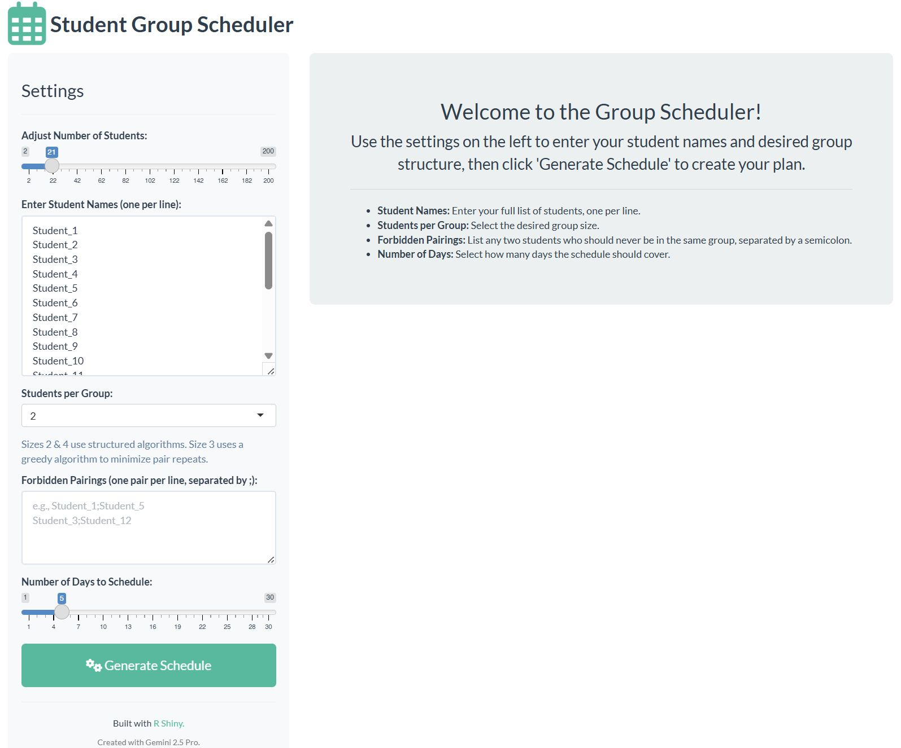

# Student Group Scheduler

https://erikstricker.shinyapps.io/StudentGroupScheduler/

A user-friendly R Shiny application for educators and project managers to create balanced, randomized group schedules for students or team members. This tool simplifies the complex task of daily group assignments, allowing for custom constraints and ensuring variety without repetition.



## Key Features

* **Balanced Group Sizes**: Automatically distributes students into groups that are as evenly sized as possible.
* **Custom Student Names**: Use a list of actual student names instead of generic IDs.
* **Forbidden Pairings**: Specify pairs of students who should never be in the same group. The app will ensure these constraints are met.
* **Dynamic Controls**: Easily adjust the number of students, maximum group size, and schedule duration with interactive sliders and inputs.
* **Interactive Schedule Table**: The final schedule is displayed in a clean, searchable table with options to copy or export the data to CSV, Excel, or PDF.
* **Responsive Design**: A clean, modern interface that works on different screen sizes.

## How to Run Locally

To run this application on your own computer, you will need R and RStudio installed.

1.  **Clone the Repository:**
    ```
    git clone [https://github.com/your-username/student-group-scheduler.git](https://github.com/your-username/student-group-scheduler.git)
    ```
2.  **Open the Project:**
    Open the `student-group-scheduler.Rproj` file in RStudio. This will automatically set up the correct working directory.

3.  **Install Required Packages:**
    Run the following command in the RStudio console to install all necessary packages.
    ```
    install.packages(c("shiny", "shinythemes", "dplyr", "stringr", "DT", "utils"))
    ```
4.  **Run the App:**
    With the `app.R` file open in RStudio, click the **"Run App"** button at the top of the editor pane, or run the following command in the console:
    ```
    shiny::runApp()
    ```

## Project Structure  
```
student-group-scheduler/  
├── student-group-scheduler.Rproj   # RStudio Project File  
├── app.R                           # The single-file Shiny application source code  
├── .gitignore                      # Specifies files for Git to ignore (like .Rproj.user)  
├── README.md                       # This README file  
└── StudentGroup-Scheduler_Webapp.jpg # Screenshot image for the README
```  

## Requirements

* **R version > 4.3.2**
* **Packages**:
    * `shiny`: The web application framework for R.
    * `shinythemes`: For modern UI styling.
    * `DT`: For creating interactive data tables.
    * `dplyr` & `stringr`: For data manipulation and string processing.

## Credits

This application was designed and developed with assistance from **Gemini 2.5 Pro**.
